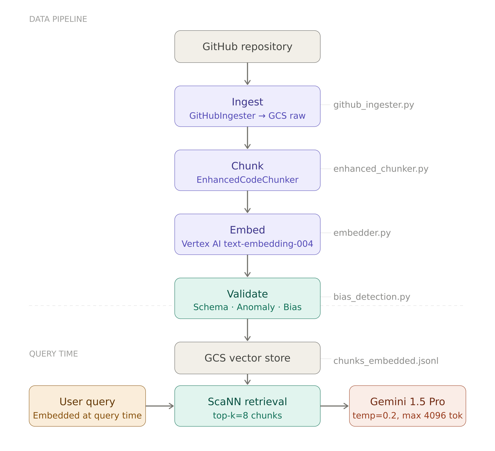
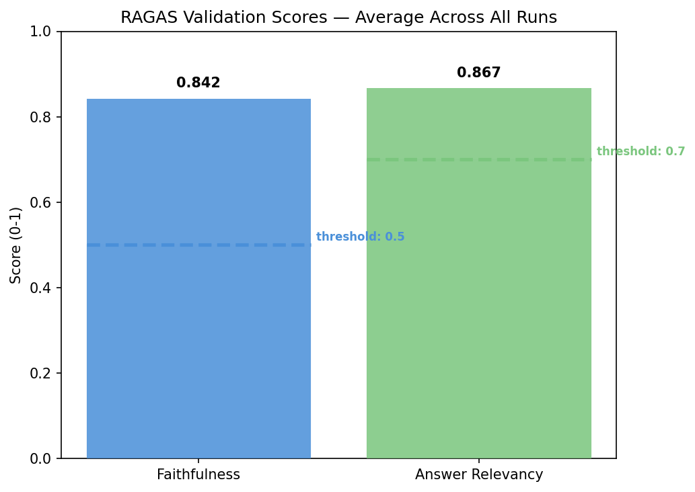
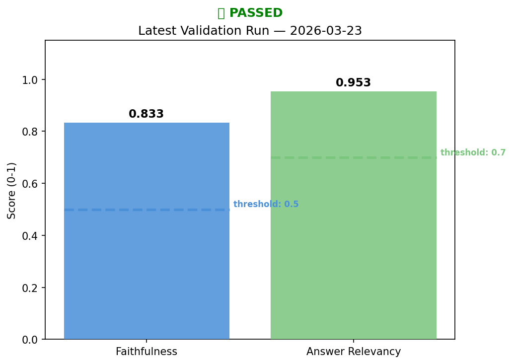
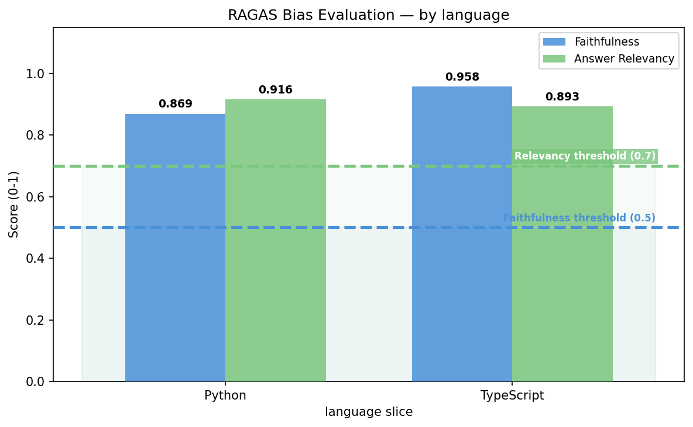
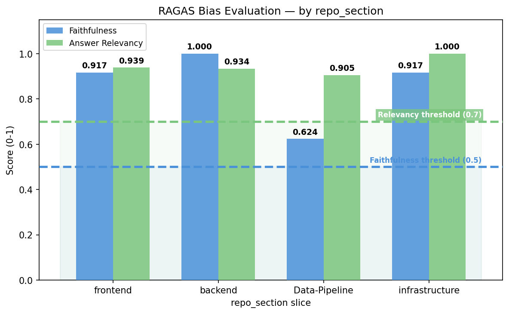
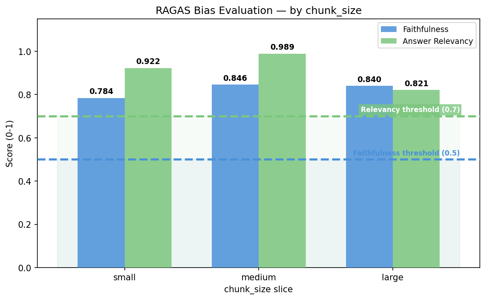
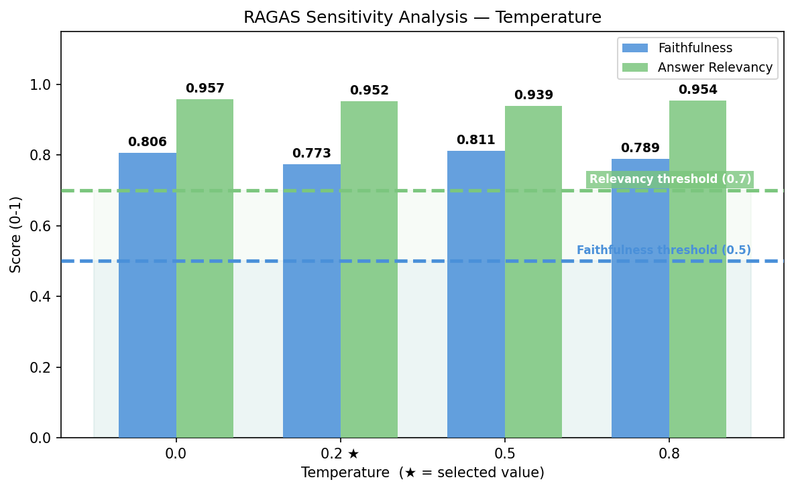
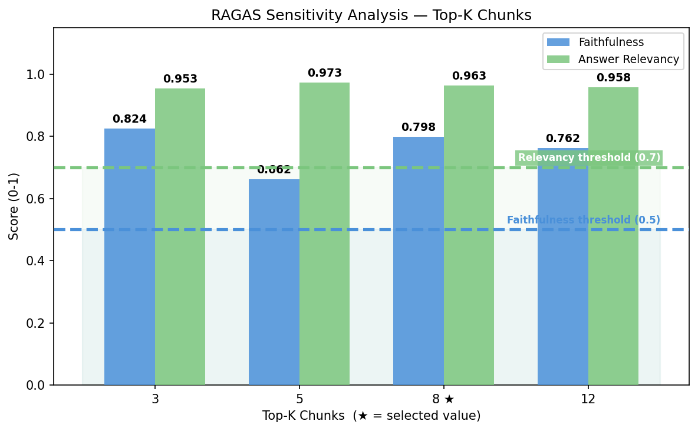
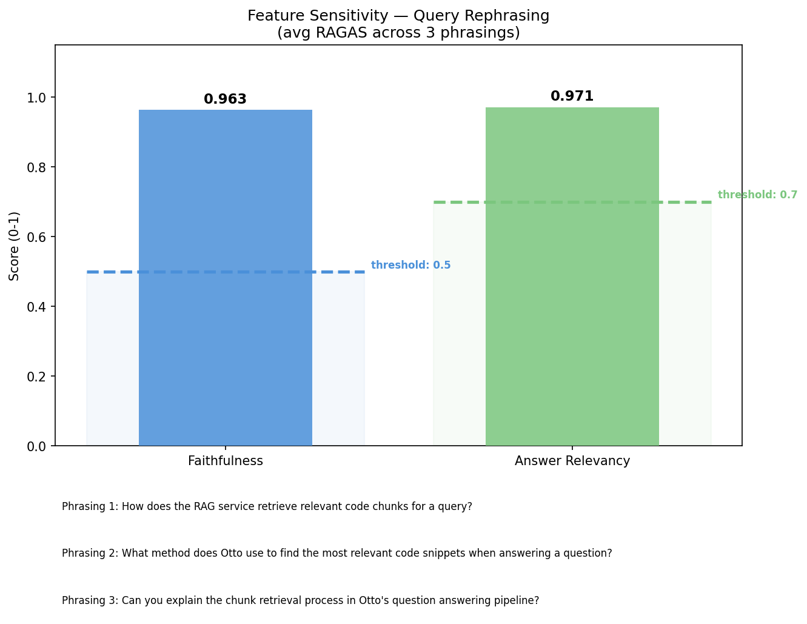

# Otto — ML Model Development Document

> **Note:** Otto uses a pre-trained large language model (Gemini via Vertex AI) rather than a custom trained model. As noted in the guidelines, some steps such as model training and hyperparameter tuning are therefore not applicable. However, validation, bias detection, tracking, and CI/CD are all implemented as described below.

---

## 1. Overview

Otto is an AI-powered project management tool that connects to GitHub repositories and provides a **Q&A** feature that answers questions about a codebase using retrieval-augmented generation.

The ML component of Otto is built around **Gemini (via Vertex AI)** — a pre-trained LLM guided through prompt engineering, retrieved context, and output guardrails. Rather than a traditional training pipeline, Otto's model development process focuses on LLM selection, RAG pipeline design, prompt experimentation, and CI/CD for automated validation, bias detection, and re-deployment.

---

## 2. Model Development and ML Code

### 2.1 Loading Data from the Data Pipeline

Otto's data pipeline processes the connected GitHub repository through four sequential stages — ingest, chunk, embed, and validate — orchestrated via Airflow and versioned with DVC. The output is a set of semantically enriched code chunks stored in Google Cloud Storage, each paired with a 768-dimensional embedding generated by Vertex AI's `text-embedding-004` model.

At query time, the user's question is embedded using the same model and a nearest-neighbour search (ScaNN via `VectorSearch`) retrieves the top 8 most relevant chunks from the vector store. These chunks are injected into the Gemini prompt as context, grounding the model's response in the actual codebase.

### 2.2 Training and Selecting the Best Model

*Otto uses Gemini 1.5 Pro via Vertex AI as a pre-trained black-box API. No training is performed. Model selection was performed by evaluating candidate LLMs against the criteria below.*

**Selection criteria considered:**

| Criterion | Rationale |
|---|---|
| Context window size | Q&A requires injecting large code chunks as context |
| Code understanding | Q&A requires reasoning over multi-language codebases |
| GCP-native availability | Minimises infrastructure complexity given existing GCP stack |
| Cost per token | Practical constraint for a project-scale deployment |

**Model comparison at time of release:**

| Criterion | Gemini 1.5 Pro ✅ | GPT-4o | Claude 3.5 Sonnet |
|---|---|---|---|
| Context window | 1M tokens | 128K tokens | 200K tokens |
| Code understanding (HumanEval) | ~71% | ~90% | ~94% |
| Input cost (per 1M tokens) | $1.25 | $2.50 | $3.00 |
| Output cost (per 1M tokens) | $5.00 | $10.00 | $15.00 |
| GCP-native | ✅ Yes | ❌ No | ❌ No |

The primary driver in selecting Gemini 1.5 Pro via Vertex AI was its native availability on Google Cloud Platform. As Otto's infrastructure is built entirely on GCP — using Cloud Run, Cloud Storage, and Vertex AI for embeddings — using Gemini avoided the need to introduce external API dependencies, kept latency low, and simplified authentication and billing under a single GCP project. Its 1M token context window was also a significant advantage for injecting large code chunks into the prompt, outperforming both GPT-4o (128K) and Claude 3.5 Sonnet (200K) on this dimension. While Claude 3.5 Sonnet leads on code understanding benchmarks, Gemini's GCP-native availability and lower cost made it the most practical choice for a project-scale deployment.

### 2.3 Model Validation

Validation is performed using RAGAS faithfulness and answer relevancy scores against a fixed set of held-out queries, run against the live RAG endpoint. Implemented in `ml-evaluation/run_validation.py`.

**Validation queries:**

| ID | Query | Type |
|---|---|---|
| val_1 | What embedding model and batch size does the ChunkEmbedder use? | Answerable |
| val_2 | How does Otto's GitHub OAuth callback work? | Answerable |
| val_3 | How does Otto authenticate users with GitHub? | Answerable |
| val_4 | What payment provider does Otto use for billing? | Not in codebase |
| val_5 | How does the RAG service retrieve relevant code chunks for a query? | Answerable |

**Results:**

| Metric | Threshold | Average Score | Result |
|---|---|---|---|
| Faithfulness | ≥ 0.5 | 0.843 | ✅ PASS |
| Answer Relevancy | ≥ 0.7 | 0.953 | ✅ PASS |

Note: faithfulness scores are inherently lower for code Q&A than factual Q&A, as the model explains and paraphrases code rather than quoting it directly. The threshold of 0.5 accounts for this variance.

### 2.4 Model Bias Detection

Bias is evaluated by slicing the dataset by programming language, repo section, and chunk size, and computing RAGAS scores per slice. Any slice scoring more than 1.5 standard deviations below the group average is flagged. No bias was detected across any dimension. Full results are in Section 6.

| Dimension | All slices passed? |
|---|---|
| Programming language | ✅ Yes |
| Repo section | ✅ Yes |
| Chunk size | ✅ Yes |

### 2.5 Code to Check for Bias

Bias checks are implemented in `ml-evaluation/run_bias_eval.py`. The script slices the dataset, computes RAGAS scores per slice, flags slices more than 1.5 stdev below average, and outputs a structured JSON bias report to `reports/bias_report.json`. Charts are generated separately by `ml-evaluation/plot_bias.py`.

### 2.6 Pushing the Model to Artifact Registry

*Not applicable — Gemini is accessed via the Vertex AI API. No model artifact exists to push.*

As noted in the guidelines, this step is not necessary for pre-trained large models. In place of pushing a model artifact, Otto versions its services via Docker images tagged with semantic version numbers and pushed to GCP Artifact Registry. Each deployment creates a new Cloud Run revision pointing to the tagged image, providing full version history, rollback capability, and traffic splitting. See Section 8.7 for details.

---

## 3. Hyperparameter Tuning

Otto does not fine-tune the underlying model, however the generation temperature and top-k retrieval count function as hyperparameters that meaningfully affect output quality. These were tuned by systematically testing temperature values (0.0, 0.2, 0.5, 0.8) and top-k values (3, 5, 8, 12) against a fixed query set using RAGAS faithfulness and answer relevancy as the optimisation metric.

**Temperature results (top_k=8 fixed):**

| Temperature | Faithfulness | Answer Relevancy |
|---|---|---|
| 0.0 | 0.806 | 0.957 |
| 0.2 ★ | 0.773 | 0.952 |
| 0.5 | 0.811 | 0.939 |
| 0.8 | 0.789 | 0.954 |

**Top-K results (temperature=0.2 fixed):**

| Top-K | Faithfulness | Answer Relevancy |
|---|---|---|
| 3 | 0.824 | 0.953 |
| 5 | 0.662 | 0.973 |
| 8 ★ | 0.798 | 0.963 |
| 12 | 0.762 | 0.958 |

Temperature 0.2 and top-k 8 were selected. Although temperature 0.0 produced the highest faithfulness score (0.806), it is overly restrictive for a code Q&A system — deterministic outputs can result in repetitive or inflexible phrasing that fails to explain code naturally. Temperature 0.2 retains near-deterministic grounding while allowing enough variation to produce clear, readable explanations. Temperature 0.5 produced a marginally higher faithfulness score (0.811 vs 0.773) but introduces greater risk of straying from retrieved context. Top-k 8 was selected as it produced the best balance of faithfulness and relevancy — top-k 5 showed a notable faithfulness drop (0.662) and top-k 12 offered no meaningful improvement over 8. Full charts are in Section 5a.

---

## 4. Experiment Tracking and Results

*Replaces MLflow / Weights & Biases. Otto tracks prompt experiments and RAGAS validation runs rather than training runs.*

All experiment runs are logged to `ml-evaluation/experiments/experiments.jsonl`. Each entry records: timestamp, prompt version, guardrails present, temperature, top-k, number of queries, RAGAS scores, pass/fail status, and thresholds. This file serves as Otto's equivalent of an experiment tracking log. Experiments were executed using the Python scripts in `ml-evaluation/` — validation via `run_validation.py`, hyperparameter sweeps via `run_sensitivity.py`, feature sensitivity via `run_feature_sensitivity.py`, and bias evaluation via `run_bias_eval.py`. Visualisations were generated by the corresponding plot scripts (`plot_val.py`, `plot_sensitivity.py`, `plot_feature_sensitivity.py`, `plot_bias.py`) and saved to `ml-evaluation/charts/`.

---

## 5. Model Sensitivity Analysis

*Replaces SHAP / LIME and hyperparameter sensitivity analysis. These techniques are not applicable to black-box LLMs — Otto uses prompt and input ablation instead.*

### 5a. Hyperparameter Sensitivity

Temperature and top-k were swept using `run_sensitivity.py` against a fixed set of 5 queries with prompt version V4. Results are logged to `experiments.jsonl` and charts saved to `charts/sensitivity/`.

Temperature had a modest effect on faithfulness (range: 0.773–0.811) with scores remaining stable across all tested values — indicating the model is not highly sensitive to temperature in this range. Answer relevancy was similarly stable (0.939–0.957). Top-k had a more significant effect: top-k 5 produced the lowest faithfulness (0.662), while top-k 3 scored surprisingly well on faithfulness (0.824) but at the cost of a narrower retrieval window. Top-k 8 offered the best balance of faithfulness and relevancy, with diminishing returns at 12. This confirms that top-k is the more impactful parameter for grounding answers in the codebase.

### 5b. Input / Feature Sensitivity

**Context degradation** is addressed through the top-k sensitivity results in Section 5a. Reducing top-k directly controls how much retrieved context is injected into the prompt — lower values degrade the breadth of the answer even if RAGAS scores do not always reflect this. Notably, very low top-k values can score deceptively well on faithfulness and answer relevancy because the model is constrained to a small, highly relevant chunk and cannot stray from it. This means the metrics do not fully capture the completeness penalty of reduced context. Top-k 8 was selected as the value that best balances retrieval breadth with answer grounding.

**Query rephrasing** was tested by running 3 differently worded versions of the same question — "How does the RAG service retrieve relevant code chunks?" — through the live endpoint and computing aggregate RAGAS scores across all phrasings. The model achieved faithfulness of 0.963 and answer relevancy of 0.971, both well above threshold. This demonstrates that Otto's RAG pipeline is robust to natural variation in how users phrase their questions.

---

## 6. Model Bias Detection (Using Slicing Techniques)

In place of demographic group slicing, Otto slices by programming language, repo section, and chunk size — the meaningful subgroups for a code Q&A system. Bias detection is implemented in `ml-evaluation/run_bias_eval.py`.

### Step 1 — Perform Slicing

The dataset is broken down by the following slices:

| Slice dimension | Values |
|---|---|
| Programming language | Python, TypeScript |
| Repo section | frontend, backend, Data-Pipeline, infrastructure |
| Chunk size | small (<200 chars), medium (200–1000 chars), large (>1000 chars) |

Python and TypeScript are the only two languages present in the Otto codebase. Otto's chunker supports six languages via tree-sitter parsers — Python, JavaScript, TypeScript, Java, Go, and Rust — all of which are among the most widely used and extensively documented programming languages. As a result, all supported languages are well-represented in Gemini's training data, making cross-language bias unlikely both in the current codebase and for any future repos connected to Otto.

### Step 2 — Track Metrics Across Slices

For each slice, RAGAS faithfulness and answer relevancy are computed and logged to `experiments.jsonl`. Any slice scoring more than 1.5 standard deviations below the group mean is flagged.

**Results — Programming Language:**

| Slice | Faithfulness | Answer Relevancy | Flagged |
|---|---|---|---|
| Python | 0.869 | 0.916 | ✅ No |
| TypeScript | 0.958 | 0.893 | ✅ No |
| *Group mean* | *0.913* | *0.905* | |

**Results — Repo Section:**

| Slice | Faithfulness | Answer Relevancy | Flagged |
|---|---|---|---|
| frontend | 0.917 | 0.939 | ✅ No |
| backend | 1.000 | 0.934 | ✅ No |
| Data-Pipeline | 0.624 | 0.905 | ✅ No |
| infrastructure | 0.917 | 1.000 | ✅ No |
| *Group mean* | *0.865* | *0.945* | |

**Results — Chunk Size:**

| Slice | Faithfulness | Answer Relevancy | Flagged |
|---|---|---|---|
| small | 0.784 | 0.922 | ✅ No |
| medium | 0.846 | 0.989 | ✅ No |
| large | 0.840 | 0.821 | ✅ No |
| *Group mean* | *0.823* | *0.911* | |

### Step 3 — Bias Mitigation

No slices were flagged as biased across any dimension. All slices scored above both metric thresholds (faithfulness ≥ 0.5, answer relevancy ≥ 0.7) and within 1.5 standard deviations of their group mean. No mitigation was required.

### Step 4 — Document Bias Mitigation

No bias was detected and no mitigation was applied. If bias had been detected, the planned mitigation strategies were:

- **Language slice flagged:** Force re-embed chunks for that language using `embedder.py` with `force_reembed=True` to improve retrieval coverage.
- **Repo section flagged:** Check chunk count for that section in `chunks_embedded.jsonl` and re-run the pipeline if the section is underrepresented.
- **Chunk size flagged:** Review chunking boundaries and adjust the size thresholds in the chunker configuration.

---

## 7. CI/CD Pipeline Automation (GitHub Actions)

Otto uses **GitHub Actions** to automate validation, bias detection, and redeployment whenever new code or data changes are pushed to the repository.

**Trigger conditions:**
- Push to `main` affecting any file in `Data-Pipeline/` → triggers data pipeline re-run + bias detection
- Push to `main` affecting backend or ingest service code → triggers redeployment

### Stage 1 — CI/CD Setup

- [ ] **TODO:** Add a GitHub Actions workflow step that runs the full data pipeline on push to `main`.

### Stage 2 — Automated Model Validation

- [ ] **TODO:** Add a workflow step that runs `run_validation.py` and fails the build if RAGAS scores fall below defined thresholds (faithfulness ≥ 0.5, answer relevancy ≥ 0.7).

### Stage 3 — Automated Model Bias Detection

- [ ] **TODO:** Add a workflow step that runs `run_bias_eval.py`, logs the full bias report as a build artifact, and fails the build if bias is detected across any slice.

### Stage 4 — Model Deployment

Once validation and bias checks pass, the backend and ingest services are automatically redeployed to Cloud Run. In place of pushing to a model registry (not applicable for a pre-trained LLM), the deployment step pushes the latest service revision to Cloud Run.

- [ ] **TODO:** Add a workflow step that redeploys backend and ingest services to Cloud Run if all previous stages pass.

### Stage 5 — Notifications and Alerts

- [ ] **TODO:** Configure Slack or email notifications for: pipeline failure, bias detected, validation failure, and successful deployment.

### Stage 6 — Rollback Mechanism

A traditional rollback mechanism does not apply to Otto because there is no model artifact being deployed — Gemini is a static external API. Rolling back means reverting to a previous Git commit via standard Git revert. Cloud Run also supports traffic splitting and revision rollback for the service layer if a deployment introduces a regression.

---

## 8. Code Implementation

### 8.1 Docker / RAG Format

Otto satisfies this requirement in two ways: the ingest service and backend are each containerised with Docker for deployment to Cloud Run, and the entire model development process is implemented as a RAG system — retrieval via ScaNN and generation via Gemini on Vertex AI.

Both services use a `python:3.11-slim` base image. The **backend** Dockerfile installs Python dependencies, copies the application code alongside Firebase credentials and GitHub private key, and serves the FastAPI app via Uvicorn on port 8080. The **ingest service** Dockerfile additionally installs `g++` to support native compilation dependencies required by the RAG and chunking libraries, copies both `src/` and `app/` directories, and sets `GOOGLE_CLOUD_PROJECT` to configure Vertex AI authentication at runtime. Both images are built and pushed to GCP Artifact Registry on each deployment, with Cloud Run creating a new revision per release.

### 8.2 Code for Loading Data from the Data Pipeline

Data is loaded at query time from the processed chunk store in GCS. The pipeline output (`chunks_embedded.jsonl`) is read by `VectorSearch` in `ingest-service/src/rag/vector_search.py`, which performs ScaNN nearest-neighbour lookup to retrieve the top-k chunks for each query.

**Key files:**
- `Data-Pipeline/scripts/run_pipeline.py` — orchestrates all 4 pipeline stages
- `Data-Pipeline/ingest-service/src/chunking/embedder.py` — generates chunk embeddings via Vertex AI in batches of 250
- `Data-Pipeline/ingest-service/src/chunking/enhanced_chunker.py` — enriches each chunk with metadata before embedding
- `Data-Pipeline/ingest-service/src/validation/schema_validation.py` — validates chunk structure and embedding dimensions
- `ingest-service/src/rag/rag_service.py` — handles retrieval and Gemini prompt construction at query time

### 8.3 Code for Training Model and Selecting Best Model

*Not applicable — no training is performed. Model selection is documented in Section 2.2.*

### 8.4 Code for Model Validation

Implemented in `ml-evaluation/run_validation.py`. Runs 5 held-out queries against the live RAG endpoint and computes RAGAS faithfulness and answer relevancy scores using `gemini-2.5-flash-lite` via Vertex AI as the judge LLM. Exits with code 1 if scores fall below thresholds, enabling use as a CI/CD gate.

### 8.5 Code for Bias Checking 

Slices the dataset by programming language, repo section, and chunk size, computes RAGAS scores per slice, flags slices more than 1.5 stdev below average, and outputs a structured JSON bias report to `reports/bias_report.json`. Supports `--dimension` and `--slice` flags for targeted reruns. Charts are generated by `ml-evaluation/plot_bias.py`.

### 8.6 Code for Model Selection after Bias Checking

Implemented in `ml-evaluation/select_prompt_version.py`. Loads all runs from `experiments.jsonl`, filters out any prompt version with a flagged bias slice, and ranks remaining versions by combined RAGAS score. V4 was selected as the final prompt version based on highest validation performance and passing bias checks across all slices.

### 8.7 Code to Push Model to Artifact Registry

*Not applicable — Gemini is accessed via the Vertex AI API. No model artifact exists to push. As noted in the guidelines, this step is not necessary for pre-trained large models.*

In Otto's case, service versioning is handled through two mechanisms: Docker images for the backend and ingest services are tagged with semantic version numbers and stored in GCP Artifact Registry, providing a full image version history. Each deployment to Cloud Run creates a new named revision pointing to the tagged image, enabling rollback to any previous revision and traffic splitting between versions if needed.

The ingest service is deployed manually via `deploy-ingest.sh`, which uses `gcloud run deploy --source=.` to build the Docker image from source and deploy it directly to Cloud Run in the `us-east1` region. The service is configured with 2Gi of memory, a 300 second request timeout, and the GCP project and GCS bucket environment variables injected at deploy time. The `--allow-unauthenticated` flag enables the RAG endpoint to be called by the frontend without requiring GCP credentials.

The backend service is deployed automatically via GitHub Actions using a dedicated GCP service account (`github-actions-deploy@otto-pm.iam.gserviceaccount.com`), triggering on pushes to `main`. Both services run in the `us-east1` region under the `otto-pm` GCP project.

- [ ] **TODO:** Confirm backend GitHub Actions deployment workflow and document whether Docker images are tagged and pushed to GCP Artifact Registry as part of the pipeline.